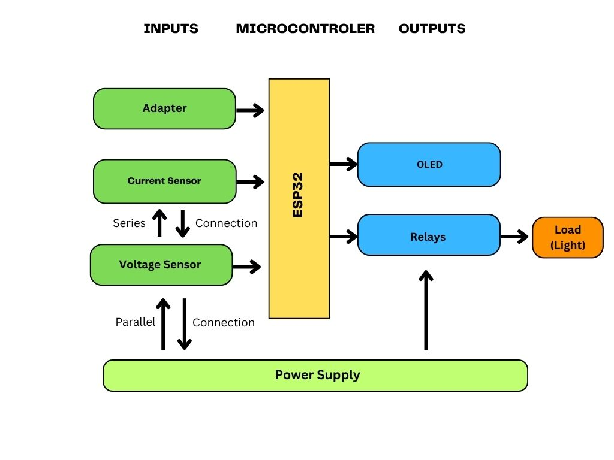
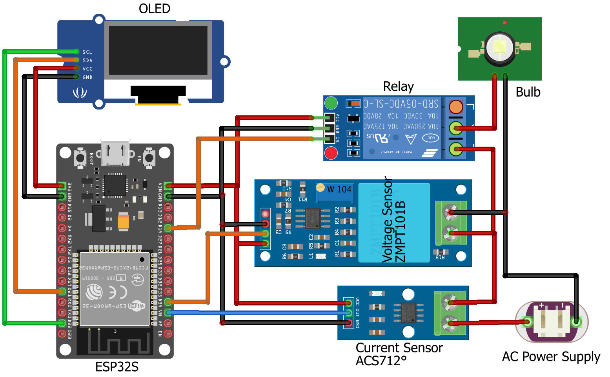
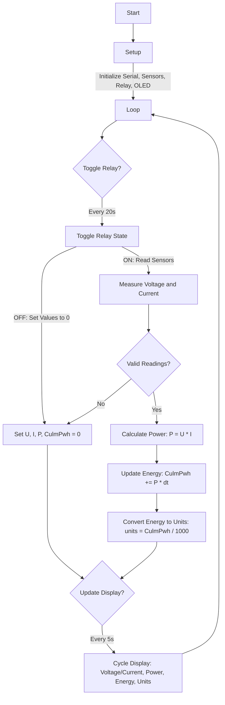

# Smart Energy Meter Using ESP32

## Project Introduction

The Smart Energy Meter is an IoT-based project designed to monitor and display real-time electrical parameters such as voltage, current, power, and energy consumption. Built using the ESP32 microcontroller, this project utilizes sensors to measure AC voltage and current, calculates power and energy usage, and displays the data on an OLED display. A relay is incorporated to simulate load control, toggling every 20 seconds. This project is ideal for home energy monitoring, educational purposes, or as a foundation for more advanced energy management systems.

## Components

- **ESP32 Development Board**: The core microcontroller for processing and control.
- **ZMPT101B Voltage Sensor**: Measures AC voltage.
- **ACS712 Current Sensor (20A variant)**: Measures AC current.
- **0.96" OLED Display (SSD1306, 128x64)**: Displays voltage, current, power, and energy data.
- **Relay Module**: Controls the load (ON/OFF) for testing purposes.
- **Connecting Wires and Breadboard**: For prototyping and connections.
- **Power Supply**: Suitable for powering the ESP32 and connected components.
- **Load**: An AC load (e.g., a bulb or small appliance) for testing.

## Libraries

The following Arduino libraries are required:

- **ZMPT101B**: For interfacing with the ZMPT101B voltage sensor.
- **ACS712**: For interfacing with the ACS712 current sensor.
- **Adafruit_GFX**: For graphics rendering on the OLED display.
- **Adafruit_SSD1306**: For controlling the SSD1306 OLED display.
- **SPI** and **Wire**: For communication protocols (I2C for OLED, SPI for general use).

Install these libraries via the Arduino IDE Library Manager or manually from their respective repositories.

## Project Details

The Smart Energy Meter measures AC voltage and current using the ZMPT101B and ACS712 sensors, respectively. The ESP32 processes these readings to calculate instantaneous power (Watts) and cumulative energy consumption (in micro Watt-hours, milli Watt-hours, or kilo Watt-hours). The data is displayed on a 0.96" OLED screen, cycling through different screens (voltage/current, power, energy, and units) every 5 seconds. A relay toggles the load ON/OFF every 20 seconds to simulate load control. Noise filtering is applied to ensure accurate readings, ignoring low or unrealistic values.

### Sensor Details

- **ZMPT101B Voltage Sensor**:
    - **Purpose**: Measures AC voltage up to 250V.
    - **Pin Connection**: Connected to ESP32 analog pin 34.
    - **Calibration**: Zero point set to 2621, sensitivity set to 0.00045.
    - **Noise Filtering**: Voltages below 5V are set to 0, and above 230V are capped at 230V.
- **ACS712 Current Sensor (20A)**:
    - **Purpose**: Measures AC current up to 20A.
    - **Pin Connection**: Connected to ESP32 analog pin 36.
    - **Calibration**: Zero point set to 2943, sensitivity set to 0.4.
    - **Noise Filtering**: Currents below 0.3A or above 20A are set to 0.

### Block Diagram

- **AC Load**: Connected through the relay for control.
- **Relay**: Controlled by ESP32 to toggle the load.
- **ZMPT101B and ACS712**: Measure voltage and current, sending analog signals to ESP32.
- **ESP32**: Processes sensor data and controls the OLED display and relay.
- **SSD1306 OLED**: Displays real-time data.

### Circuit Diagram

**Note**: Ensure proper insulation and safety precautions when working with AC circuits. Use a suitable power supply for the ESP32 and verify all connections before powering on.

## Code : Flowchart

## Working Procedure

1. **Setup**:
    
    - The ESP32 initializes the sensors, OLED display, and relay.
    - The ZMPT101B and ACS712 sensors are calibrated with predefined zero points and sensitivities.
    - The OLED display is initialized with I2C communication at address 0x3C.
    - The relay starts in the OFF state (HIGH).
2. **Main Loop**:
    
    - The relay toggles every 20 seconds (ON: LOW, OFF: HIGH) to simulate load control.
    - When the relay is OFF, voltage, current, power, and energy are set to 0.
    - When the relay is ON:
        - Voltage (U) and current (I) are read from the ZMPT101B and ACS712 sensors.
        - Noise filtering ensures valid readings (U < 5V or > 230V, I < 0.3A or > 20A are ignored).
        - Power (P = U * I) is calculated if both U and I are valid.
        - Cumulative energy (CulmPwh) is updated based on power and time elapsed (in micro Watt-hours).
        - Energy is converted to units (milli Watt-hours).
3. **Display**:
    
    - The OLED display cycles through four screens every 5 seconds:
        - **Screen 1**: Voltage (V) and Current (A).
        - **Screen 2**: Instantaneous Power (W or kW).
        - **Screen 3**: Cumulative Energy (uWh, mWh, Wh, or kWh).
        - **Screen 4**: Units (micro, milli, or standard units).
    - Text is centered on the display for readability.
4. **Serial Output**:
    
    - Debug information (voltage, current, power, energy) can be monitored via the Serial Monitor at 9600 baud.

## Additional Notes

- **Safety**: Handle AC connections with care. Use proper insulation and ensure the circuit is powered off during assembly.
- **Calibration**: Adjust the zero point and sensitivity values for ZMPT101B and ACS712 based on your specific setup for accurate readings.
- **Extensibility**: The project can be extended by adding Wi-Fi connectivity to send data to a cloud server or mobile app using ESP32’s capabilities.
- **Power Supply**: Ensure the ESP32 and sensors are powered with a stable 3.3V/5V supply.
- **Troubleshooting**:
    - If the OLED display fails to initialize, check I2C connections and the screen address.
    - If sensor readings are erratic, verify calibration values and check for loose connections.

## Future Improvements

- Add Wi-Fi connectivity to log data to a cloud platform (e.g., Blynk, ThingSpeak).
- Implement a user interface for manual relay control.
- Add data logging to an SD card or external memory.
- Enhance noise filtering algorithms for improved accuracy.
